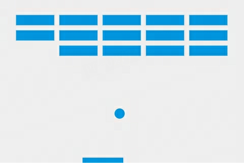
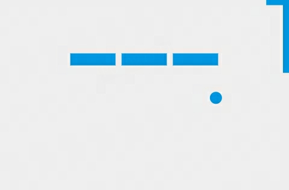
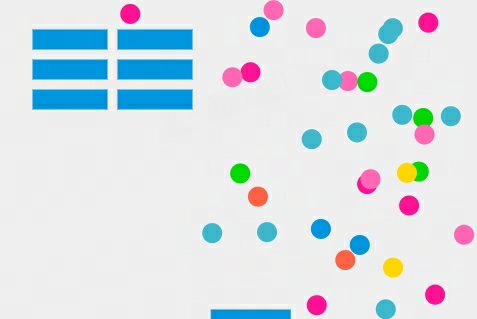

# BreakOut-Surprises
A Html Breakout based on JavaScript, but full of surprises！

 
 

### How to play
Just download the `breakout.html` and open it with your browser.

### Tools
- ReadFile.html: A simple tool to convert a picture to binary array data, which can be used in the game.

### Statement
This project is based on [Gamedev-Canvas-workshop](https://github.com/end3r/Gamedev-Canvas-workshop).
